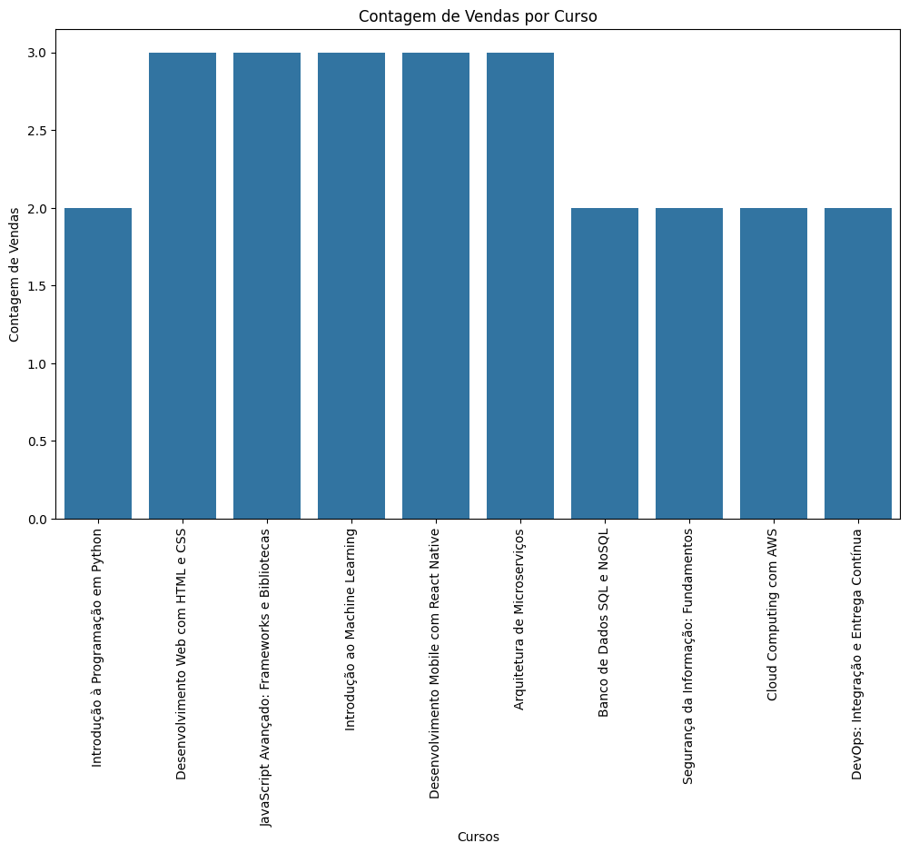
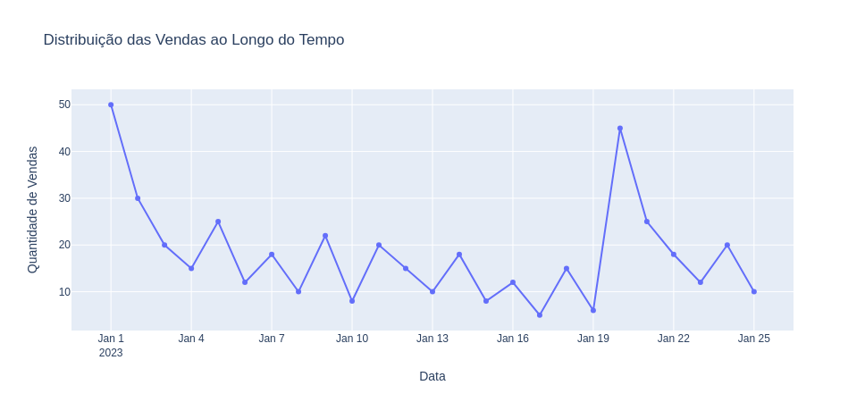
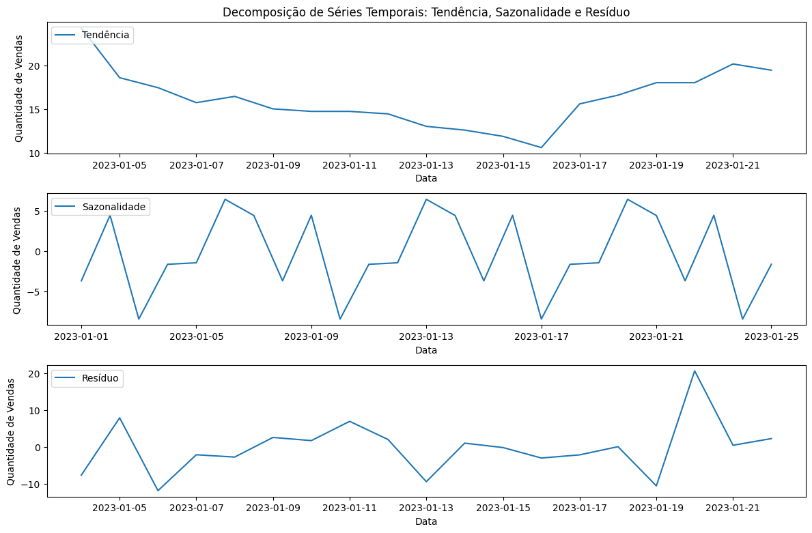

# Análise de Vendas de Cursos Online

Este projeto realiza uma análise básica de dados de vendas de cursos online utilizando Python no Jupyter Notebook. O conjunto de dados utilizado contém informações sobre cursos vendidos, incluindo o nome do curso, quantidade de vendas, preço unitário e data da venda.

## Estrutura do Projeto

O projeto está estruturado da seguinte forma:

- **data/arquivo.csv:** Arquivo CSV contendo os dados de vendas de cursos.
- **img/**: Imagens dos gráficos gerados durante a análise.
- **analise_vendas.ipynb:** Notebook Jupyter contendo o código para análise de dados.
- **requirements.txt:** Arquivo de requisitos especificando as bibliotecas Python necessárias para o projeto.

## Conjunto de Dados

O conjunto de dados utilizado contém as seguintes colunas:

- **ID:** Identificador único de cada curso vendido.
- **Nome do Curso:** Nome do curso vendido na plataforma.
- **Quantidade de Vendas:** Número de vendas realizadas para cada curso.
- **Preço Unitário:** Preço unitário do curso.
- **Data:** Data da venda do curso.

## Desafios Propostos

- **Receita Total:** Cálculo da receita total gerada pela venda dos cursos.
- **Curso com Maior Número de Vendas:** Identificação do curso que teve o maior número de vendas.
- **Visualização Temporal:** Visualização da distribuição das vendas ao longo do tempo através de gráficos.

## Como Executar

1. **Instalação das Bibliotecas:**
   ```
   pip install -r requirements.txt
   ```

2. **Executar o Notebook:**
   - Navegue até o arquivo `analise_vendas.ipynb` e abra-o.
   - Execute as células de código para carregar os dados, realizar análises estatísticas e gerar gráficos.

## Resultados e Conclusões

Após realizar a análise dos dados de vendas de cursos online, os seguintes insights foram obtidos:

### Receita Total

A receita total gerada pela venda dos cursos foi calculada em R$ 32,735.10. Isso foi obtido multiplicando a quantidade de vendas pelo preço unitário de cada curso e somando os resultados.

### Curso com Maior Número de Vendas

O curso que teve o maior número de vendas foi **Introdução à Programação em Python**, com um total de 50 vendas realizadas.

### Os cursos que apresentaram as maiores contagens de vendas foram:

- Desenvolvimento Web com HTML e CSS
- JavaScript Avançado: Frameworks e Bibliotecas
- Introdução ao Machine Learning
- Desenvolvimento Mobile com React Native
- Arquitetura de Microserviços



### Visualização Temporal

A distribuição das vendas ao longo do tempo foi analisada através de gráficos. Foi observado que os maiores picos de vendas ocorreram em 01-01-2023 e 21-01-2023. Esses dias específicos mostraram uma atividade significativamente maior, possivelmente devido a promoções ou outros fatores desconhecidos.


### Decomposição de Séries Temporais

Além das análises anteriores, foi realizada uma decomposição de séries temporais para entender melhor os padrões de tendência, sazonalidade e resíduos nas vendas ao longo do tempo. Abaixo estão os gráficos resultantes:



Neste gráfico:
- **Tendência:** Representa a tendência geral das vendas ao longo do tempo.
- **Sazonalidade:** Mostra padrões sazonais recorrentes nas vendas.
- **Resíduo:** Reflete as variações irregulares ou aleatórias que não são explicadas pela tendência ou sazonalidade.